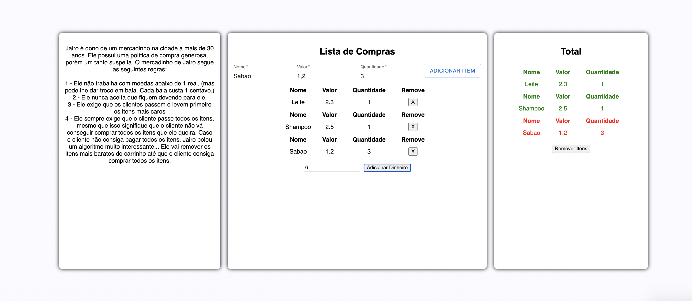

Temas:

- PD

# Mercadinho

**Número da Lista**: 5<br>
**Conteúdo da Disciplina**: PD<br>

## Alunos

| Matrícula | Aluno                         |
| --------- | ----------------------------- |
| 180011600 | Ailton Aires Amado            |
| 180042386 | Kevin Luis Apolinario Batista |

## Sobre

O projeto utiliza o algoritmo knapsack estudado em programação dinâmica para controlar itens em uma lista de compras do Mercadinho do Jairo. Ao mesmo tempo para remover os itens da lista de compras quando o valor da lista ultrapassa a quantidade de dinheiro que o usuário tem é utilizado um knapsack "inverso". Este mercadinho possui algumas regras duvidosas...

## Screenshots





## Instalação

**Linguagem**: Javascript, HTML e CSS<br>
**Framework**: React Js<br>

- node.js >= 16

## Uso

Para rodar o projeto utilize os comandos:

```
git clone https://github.com/projeto-de-algoritmos/PD_Mercadinho.git
```

```
cd PD_Mercadinho
```

```
npm install
```

```
npm start
```

O projeto estará rodando em: http://localhost:3000

## Outros
